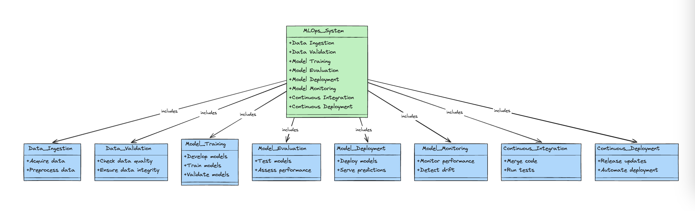
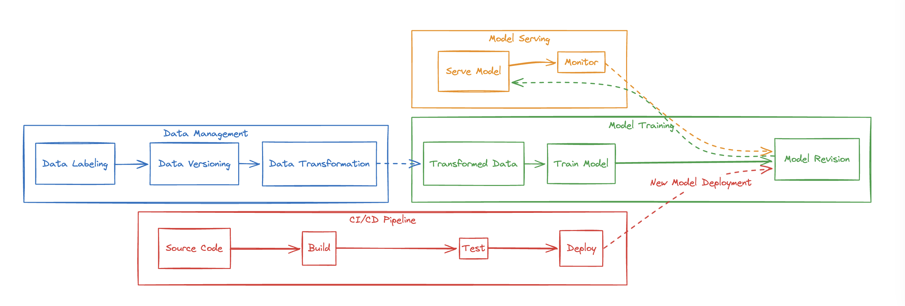
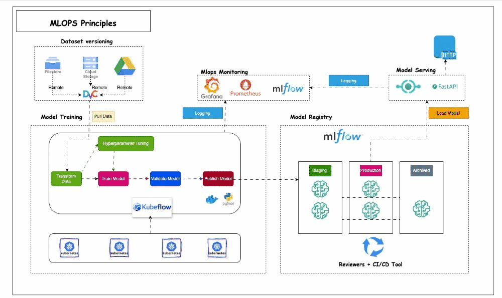

# MLOPS

## What is MLOPS?
Machine learning operations (MLOps) are a set of practices that automate and simplify machine learning (ML) workflows and deployments. Machine learning and artificial intelligence (AI) are core capabilities that you can implement to solve complex real-world problems and deliver value to your customers.

## Build a Full MLOps Solution For Machine Learning System

**MLops System**

    

**MLops Flow**

    

**MLops Principles**

    

## Technologies
- Cloud: AWS, GCP, Azure, ...
- Experiment tracking tools: MLFlow, Weights & Biases, ...
- Workflow orchestration: Prefect, Airflow, Flyte, Kubeflow, Argo, ...
- Monitoring: Evidently, WhyLabs/whylogs, ...
- CI/CD: Github actions, Gitlab CI/CD, ...
- Infrastructure as code (IaC): Terraform, Pulumi, Cloud Formation, ...

## Contributing
The project has a separate contribution file. Please adhere to the steps listed in the separate contributions [file](./CONTRIBUTING.md)

## License

# DEMO WOKRING DEBUG TRACKING